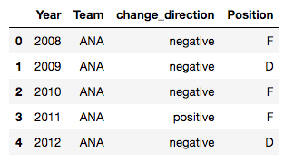
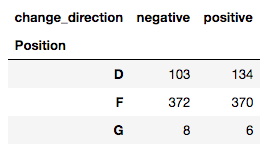
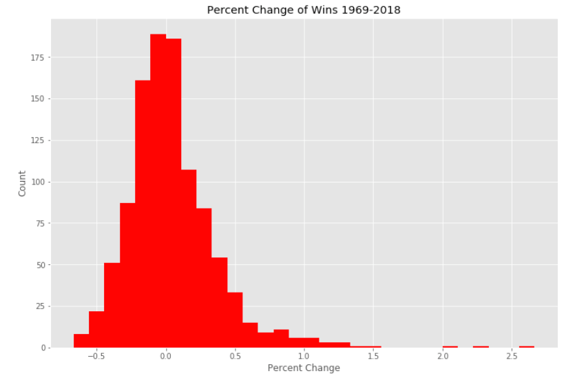
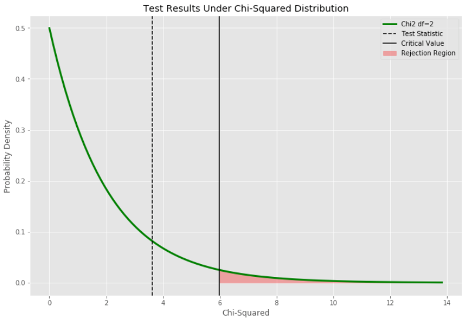

# NHL Hockey Draft Preference vs. Performance

The aim of this study was to answer the question, "Does preference for certain types of players in the preseason NHL draft result in a difference in team performance during the season?" 

Performance in this study is examined using wins and the difference in performance is the win percent change YoY. Additionally, each player has one of three main play positions: forward, defenseman, and goalie. Favored players are picked earlier in the draft, and so if a team picks a certain type of position earlier, it is said to prefer that position.

In order to answer this question draft data and performance data were gathered and a chi-squared test was run to understand any potential relationship that may exist between draft preference and performance. This study consisted of three main components:

- **Web Scraping**
    - *Information Sourcing*
    - *Created Webscraper Script*
    - *AWS EC2*
    - *NoSQL: Mongodb*

- **Data Munging**
    - *Cleaning in Pandas*
    - *Groupby and Merge*

- **Statistical Analysis**
    - *Histogram*
    - *Chi-Squared Test*

## Web Scraping

NHL draft data was sourced from http://www.nhl.com/ice/draftsearch.htm?year=&team=&position=&round=1 and includes player data by draft round.

Season performance data was sourced https://www.hockey-reference.com/leagues/NHL_1998.html and includes team performance data by season.

A web scraper script was created to programmatically scrape data from the above sites, do some initial parsing, and then store the data in a database. The script, web_scraper.py, can be found in the src folder of this repository. The script was implemented on an AWS EC2 machine so that the program could be let continue for an extended period of time given the built in sleeps to keep the data collection process respectful of the source sites. The data was stored in a MongoDB database and then brought locally for data munging.

## Data Munging
The data were cleaned using the Pandas package to organize data into dataframes, handle NaN fields, and set field datatypes.

Pandas groupby was used to prepare the two data sets for a merge. Each of the draft and performance data sets were grouped by team and year. Then the data were merged on those values,
on an inner join.

Final transformations were done to get the data to aggregate instances of team preference by position and performance. 

## Statistical Analysis

A histogram was made to represent the win percent change of different teams from 1969-2018

The frequencies are approximately normally distributed with some slight left skewness and outliers in the right tail. 

Next, a Chi-Squared test was run to understand if there is a relationship between preferences in draft rounds and team performance. The confidence interval for the test was 95% and degrees of freedom was two given the player categories (forward, defenseman, and goalie) and the two modes of win percent change (positive change and negative change). 

The test resulted in a test statistic of 3.61, which under the chi-squared distribution where df=2, yielded a p-value of 0.16. This value fell well outside the rejection region of 0.05. We therefore cannot conclude on the relationship between position preference and performance given the data. The test results are graphed below:

## Final Thoughts

Although the test statistic fell outside the rejection region, my interpretation is that there still might be a relationship that we weren't able to conclude on. The test statistic fell ahead of the distribution mean, and more intuitively it makes sense that incoming players to a team's roster would have impact on their season performance. My ultimate conclusion is a call for further study and the inclusion of more data. I think this can be broached in two different ways. A more broad inclusion of player data to include all incoming players to a team and their position. This would likely mean a need for player trade data. Another more granular approach to increasing the data would be to include player specific statistics. It makes sense that player history would give some insight into how that player might impact team-level performance.